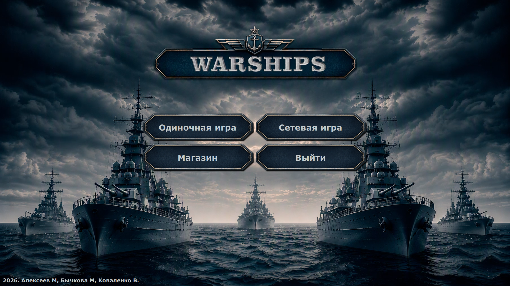
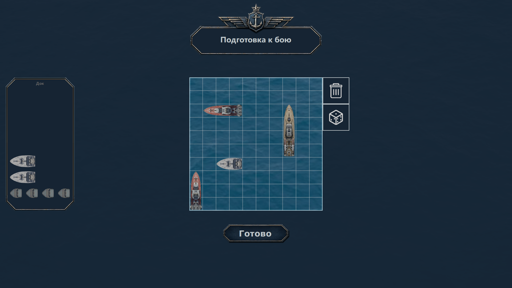
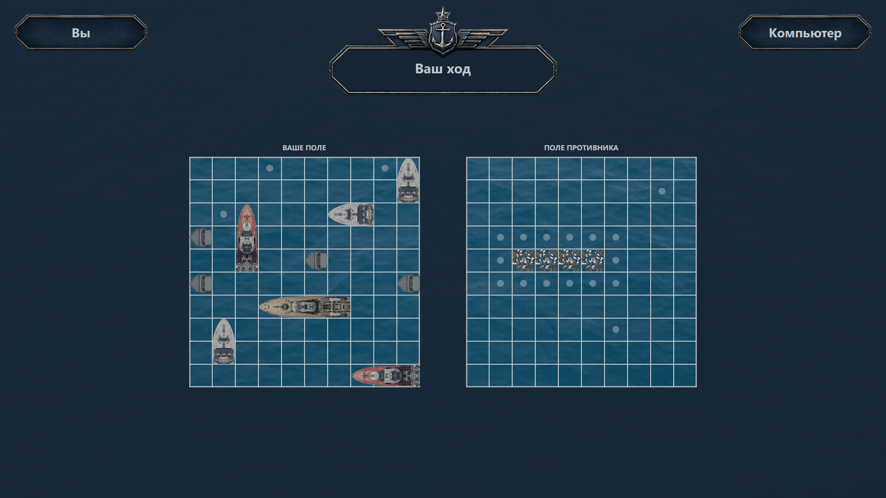

# Warships

A desktop implementation of the classic Battleship game, developed as a collaborative software engineering project at FAMCS.

## Overview

The project implements a multiplayer Battleship game with a graphical user interface, game logic, client-server interaction, and an AI opponent.
The project was developed collaboratively, with different team members working on the game logic, server-side functionality, AI, and user interface.

## Features

- Multiplayer Battleship gameplay
- AI opponent
- Graphical user interface
- Client-server interaction
- Game logic and state management
- Screen navigation and dynamic screen loading
- UI animations and transitions
- Interactive game controls
- Responsive interface elements

## Technologies

- C++
- Qt / QML
- Client-server architecture
- Object-oriented programming

## Contributions

### [Maria Buchkova](https://github.com/maria11-lab)  — Frontend \& UI Integration

- Developed and integrated game screens, control windows, and interactive UI elements using Qt/QML.
- Worked with the existing screen-loading and navigation system and connected UI controls with the game logic and server-side functionality.
- Implemented UI animations and transitions, including the battlefield loading transition and screen-dimming effects.
- Redesigned the main menu, added missing control windows, and implemented animated pop-up elements.
- Improved responsive layouts and adaptive sizing of interface elements.

### [Mikhail Aliakseyeu](https://github.com/Mideninkin) — AI

- Developed the AI opponent and its decision-making logic.
- Implemented AI behaviour for playing against a human player.
- Integrated the AI with the existing game logic and gameplay flow.
- Tested and refined AI behaviour within the game.
- Integrated the AI component into the overall application.

### [Vlad Kovalenko](https://github.com/VladKoBY07) — Backend \& Core Game Architecture

- Developed the core game logic and implemented the main gameplay mechanics.
- Developed the server-side functionality and worked on peer-to-peer communication between players.
- Implemented game-state management and synchronization between connected players.
- Developed functionality for managing and removing ships and other game objects from the playing field.
- Designed and developed the application's Model-View architecture and integrated the core components of the game around it.

## Technical Highlights

- Qt/QML-based UI development
- Screen navigation and dynamic screen loading
- Integration of UI controls with game logic
- Client-server communication
- AI opponent
- UI animations and transitions
- Responsive interface layouts

## Screenshots

### Requirements

- C++
- Qt

### Build

The project is configured and built using CMake through Qt Creator.

1. Clone the repository.
2. Open the `Warships\_v0` directory in **Qt Creator**.
3. Open the project's `CMakeLists.txt`.
4. Select the appropriate Qt kit and configure the project.
5. Build the project using Qt Creator.
6. Run the application.

## Team

Collaborative project developed by FAMCS students.

- [Maria Buchkova](https://github.com/maria11-lab)

- [Mikhail Aliakseyeu](https://github.com/Mideninkin)

- [Vlad Kovalenko](https://github.com/VladKoBY07)

